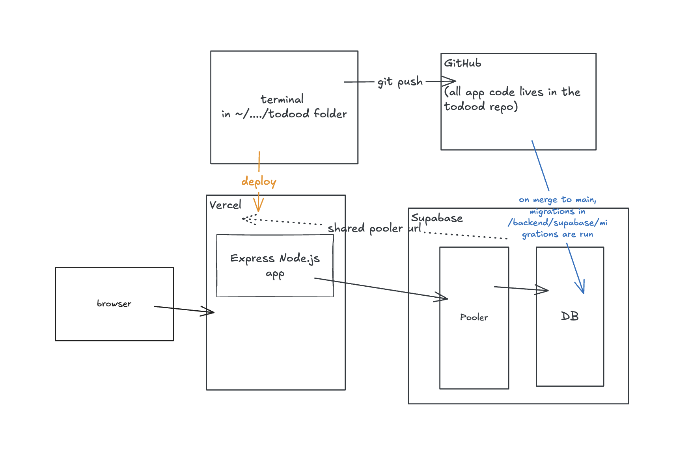

# Decision Log
## 11. Expo rather than bare React Native CLI

**Date:** 2026-08-31

**Decision:** Build the frontend with Expo.

**Reasoning:** Bare RN CLI does not target web at all — Metro is native-only and there is no HTML entry point. And every native dependency added afterwards needs a web implementation or a hand-written shim, because a native module is Swift or Kotlin behind a JS interface and does not exist in a browser.

The React Native docs point at a framework first rather than the bare CLI, and Expo is the default one.

**Tradeoff:** Another layer between the app and the platform that I won't implement on my own. But it's acceptable because my goal isn't to learn about native build tooling.

## 10. Stateless JWTs in the Authorization header, no refresh tokens

**Date:** 2026-08-27

**Decision:** Authenticate with a single JWT access token, signed with a `JWT_SECRET`, expiring in 24 hours, sent as `Authorization: Bearer <token>`. No refresh tokens, no session table, no cookies.

**Reasoning:**

_JWT over a session id in a table:_ a JWT is self-contained, so verifying it is a signature check rather than a database round trip on every request. That costs per-token revocation — once signed, a token is valid until it expires, and there is no way to kill an individual one early. Acceptable for an in flight proj that's probably going to switch to Supabase auth anyway.

_Header over cookie:_ React Native doesn't use cookies, so easy decision.

_No refresh tokens:_ A lot of moving parts for a threat the app doesn't have yet. Would want this eventually, though! It costs a table and its cleanup, a `/refresh` endpoint, client retry logic that doesn't fire N refreshes for N parallel 401s, and rotation with reuse-detection to actually catch theft.

**Tradeoff:** A stolen token is a valid identity until it expires, and there is no targeted way to cancel it. `expiresIn` is the only fine-grained lever, which is why 24h rather than something longer.

There is, however, one blunt lever: **rotating `JWT_SECRET` invalidates every token ever signed with the old value**, immediately. Verification is just a signature check against the current secret, so changing it makes every outstanding token fail with `invalid signature`. That is a global logout, not a targeted one — it cannot revoke a single stolen token without kicking out everyone at once. With one user that distinction costs nothing, which makes it a perfectly good panic button today. As of 2026-08-31 the secret is set in Vercel (production and preview) rather than only `.env.local`, so rotating it in prod is a `vercel env` change plus a redeploy — note the redeploy, since env changes only reach new deployments.

Also: the id inside the token is never re-checked, so a deleted user's token still verifies — the query just returns nothing.

**Later:** Revisit if a *per-user* "sign out of all devices" button is ever wanted, or if ever actually want to protext the todo data. Either one means refresh tokens (or moving to Supabase Auth, per #5 and #9). Not before — an all-users-at-once logout already exists via secret rotation above, and that covers the realistic panic case while this is a single-user app. The tripwire is a second real user: from that point on, rotation stops being free, because cutting off one compromised session also cuts off everyone else's.

See `learnings/auth-tokens.md` for the underlying concepts.

## 9. Return 409 on duplicate registration

**Date:** 2026-08-25

**Decision:** `/register` returns `409 Conflict` when the email is already taken, rather than returning an identical generic response for both new and existing addresses. Not dealing with email verification yet.

**Reasoning:** Returning the same response either way is the standard defence against email enumeration. But setting up the ability to send emails to users is not high up on my priority of things to learn atm.

**Tradeoff:** This endpoint leaks which emails have accounts. That is acceptable right now since I will be only user, but would need to be remedied if real users. (At which point I'd probably just be using Supabase's authentication services anyway).

## 8. Vercel for hosting the API

**Date:** 2026-08-25

**Decision:** Deploy API service to Vercel. Will use CI to deploy for now just for ease. Vercel runs the app as serverless functions so need to connect through Supabase's transaction pooler instead of a singular client.

**Reasoning:** Vercel detects and deploys an Express app
without needing to deal with configuration. The free tier allows enough traffic for the app (just me) and the preview deployment urls will be nice.

Vercel doesn't provide a single long-running server. Instances start on demand then will get thrown away, which breaks the single Supabase Client connection. Pool fixes this by opening (and then closing) connections only when needed. Postgres can only accept a certain number of connectinos, but Supabase's pooler sits in front of the DB and collapses them all into a smaller number of connections.

## 7. Managed Postgres from a third party

**Date:** 2026-08-21

**Decision:** Use Supabase for hosted Postgres instead of running the database on our own server. Skip the intermediate step of putting the database and the application on the same machine. Use only its Postgres — not its Auth, REST, or Storage services (see #5). Deploy to production on merge to main.

**Reasoning:** Database operations — backups, patching, failover, restores — are a separate skill from backend development, and getting them wrong loses data. Letting a vendor own that removes the highest-consequence failure mode from the learning project; self-managing Postgres is still available later as a deliberate exercise. Supabase is the popular choice at small-project scale, where PlanetScale is aimed at production scale we don't have. Running the DB on the app server was considered and skipped: it's a dead-end configuration that has to be undone before any real deployment, so it isn't worth the detour. The tradeoff is that the app now holds database credentials and connects over the network, which makes secrets handling a real concern rather than a theoretical one: the connection string is stored on the server (env vars now, a secrets manager later), never committed, and the connection is TLS-only.

Deploying on merge to main in effort to keep prod DB clean and follow Supabase's recommended approach.

## 6. Raw SQL files for database migrations

**Date:** 2026-08-10

**Decision:** Use raw SQL files for database migrations instead of a migration tool (db-migrate, Knex.js, Sequelize).

**Reasoning:** Raw SQL files are simple and educational — you see exactly what's running, no abstraction layer. Good for a learning project. If automation is needed later, a tool can be added then.

## 5. Basic password authentication

**Date:** 2026-08-10

**Decision:** Implement basic password-based authentication (email + password hash) instead of using off-the-shelf auth services.

**Reasoning:** To learn authentication fundamentals — how password hashing and tokens work. Keeping it educational without spending too much time on it since it doesn't need to be production ready (yet!)

## 4. Express for HTTP framework

**Date:** 2026-08-10

**Decision:** Use Express as the Node.js HTTP framework.

**Reasoning:** Express is the most widely used Node.js framework with the largest community and most tutorials/documentation. Goal is not to learn a new programming language.

## 3. Postgres version 17

**Date:** 2026-08-10

**Decision:** Use Postgres 17 instead of the latest version (18) or an older version.

**Reasoning:** Version 17 is one major version behind current, giving it stability and maturity while not being outdated. EOL is 2029, which is acceptable for a learning project. Pins to a specific version for reproducibility rather than always using `latest`.

## 2. Postgres for database

**Date:** 2026-08-10

**Decision:** Use PostgreSQL instead of MySQL or SQLite.

**Reasoning:** For a learning project focused on backend, Postgres is worth the extra setup because it's the industry standard, so learning it is the best long-term investment. MySQL would work but isn't used as widely in modern backends. SQLite would be simpler but less realistic to production environments. The added complexity of Postgres + Docker is intentional — both are worth learning as part of a real backend education.

## 1. Frontend and backend in same monorepo

**Date:** 2026-08-10

**Decision:** Keep frontend and backend as separate codebases (distinct folders) within a single monorepo, rather than splitting into separate repositories.

**Reasoning:** Separate folders keep frontend and backend code cleanly split with distinct package.json, build config, and dev servers. Separate repos would add overhead (coordinating changes across repos, managing multiple git remotes) that teaches DevOps/infrastructure lessons, not core backend lessons. One repo, two folders is cleaner for focusing on the backend code itself.
